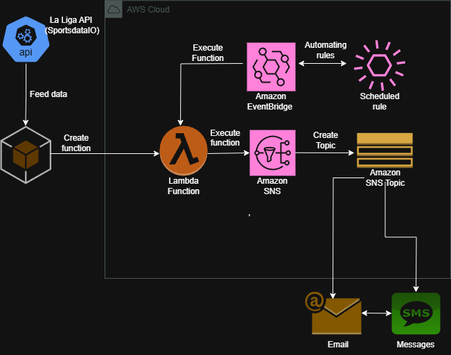

<p align="center">
  
  
## ☁️ 30 Days DevOps Challenge - La Liga Game Day Notifications / Sports Alerts System  ☁️

This is part of the second project in the 30-day DevOps challenge! 

In this project, I built an event-driven system to deliver real-time game notifications for La Liga's Soccer competition. Using Amazon EventBridge, we’ll capture events and trigger automated workflows powered by AWS Lambda. Notifications will be sent via email or text messages through Amazon SNS. Game data will be fetched dynamically from the Sportsdata API, ensuring accurate and timely queries for our Soccer event! 🌟


<h2>Environments and Technologies Used</h2>

  - Python
  - AWS Lambda
  - Amazon Eventbridge
  - Amazon SNS
  - Sportsdata API
  - gitpod


  
<h2>Real World applications</h2>  

🏀 Sports Fan Alerts:
- Get instant notifications about your favorite team's game updates, like goals, touchdowns, or final scores!
  
🕹️ Esports Notifications:
- Stay updated on live esports tournaments, match results, and player stats in real time.

💼 Business Applications:
- Sports media companies can use this system to send live updates to their subscribers or boost audience engagement.


<h2>Step by Step Instructions</h2>

***1. Repo and API configuration***

We will begin by setting up the environment and code that we will be utilizing. In this instance, we will use gitpod to create a new workspace and do the commands from there. We will be setting up an account with sportsdata API in order to get our API KEY to be used in our end. 


***2. AWS CLI Setup and IAM Role creation***

NOTE: Keep in mind this is for a Linux environment, check the AWS documentation to install it in your supported Os.

   ```
   curl "https://awscli.amazonaws.com/awscli-exe-linux-x86_64.zip" -o "awscliv2.zip"
unzip awscliv2.zip
sudo ./aws/install
```
We then do `AWS configure` and enter our access and secret key along with the region. Output format set to JSON. With this command we will double check that our credentials are put in place for CLI:

```
aws sts get-caller-identity
```

For IAM roles, we want to make sure we get lambda and eventbridge roles to be used for this. We will be using CLI commands. 

```
aws iam create-role \
    --role-name LambdaEventBridgeFullAccessRole \
    --assume-role-policy-document '{
        "Version": "2012-10-17",
        "Statement": [
            {
                "Effect": "Allow",
                "Principal": {
                    "Service": "lambda.amazonaws.com"
                },
                "Action": "sts:AssumeRole"
            }
        ]
    }'
```

This will create the roles with inline trust policy. Next, we will attach them to the role.

```
# Attach AWSLambda_FullAccess policy
aws iam attach-role-policy \
    --role-name LambdaEventBridgeFullAccessRole \
    --policy-arn arn:aws:iam::aws:policy/AWSLambda_FullAccess

# Attach AmazonEventBridgeFullAccess policy
aws iam attach-role-policy \
    --role-name LambdaEventBridgeFullAccessRole \
    --policy-arn arn:aws:iam::aws:policy/AmazonEventBridgeFullAccess
```

Lastly, we will confirm role access.

```
aws iam list-attached-role-policies --role-name LambdaEventBridgeFullAccessRole
```

We can also check in the AWS console.


***3. Create SNS Topic and create a JSON policy***

Next, we will be creating the SNS topic along with creating the subscription for the topic and the JSON policy for publish!

```
aws sns create-topic --name gd_topic
```

It will display the ARN of the topic.


Then, we will create a subscription with an Email and SMS protocol. Replace arn with user-generated topic arn as well as the email to be subscribed to and phone number.

```
aws sns subscribe \
    --topic-arn arn:aws:sns:us-east-1:123456789012:gd_topic \
    --protocol email \
    --notification-endpoint youremail.com
```

```
aws sns subscribe \
    --topic-arn arn:aws:sns:us-east-1:123456789012:gd_topic \
    --protocol sms \
    --notification-endpoint yourphonenumber
```
You can check the subscriptions on the CLI(Replace the topic ARN) or in the console.

```
aws sns list-subscriptions-by-topic \
    --topic-arn arn:aws:sns:us-east-1:123456789012:gd_topic

```


This is how it will look like in the console.


Next, we will create the sns publish policy.

```
aws iam create-policy \
    --policy-name gd_sns_policy \
    --policy-document '{
        "Version": "2012-10-17",
        "Statement": [
            {
                "Effect": "Allow",
                "Action": "sns:Publish",
                "Resource": "arn:aws:sns:us-east-1:123456789012:gd_topic"
            }
        ]
    }'
```

We can check if it was created successfully.

```
aws iam list-policies --query "Policies[?PolicyName=='gd_sns_policy']"
```

Finally, we will attach permissions to the SNS policy. "myrole" will be exchanged by the role created and we will set the policy arn of the previously created gd_sns_policy.

```
aws iam attach-role-policy \
    --role-name myrole \
    --policy-arn arn:aws:iam::123456789012:policy/gd_sns_policy
```


***4. Deploy Lambda Function***

In this step, we will create the function in the AWS console for easy of use selecting author from scratch with the name `gd_notifications` and Python 3.x as the runtime, as well as get the role assigned to the function.


***5. Automation Set up with Amazon Eventbridge***

In this step, we will be setting up automation with amazon eventbridge to be connected with out lambda function `gd_notifications`

```
aws events put-rule \
    --name "HourlyUpdateRule" \
    --schedule-expression "cron(0 * * * ? *)" \
    --state "ENABLED" \
    --description "Triggers gd_notifications function every hour"
```

We will then set the lambda function as target for the rule.

```
aws events put-targets \
    --rule "HourlyUpdateRule" \
    --targets "Id"="1","Arn"="arn:aws:lambda:<REGION>:<ACCOUNT_ID>:function:gd_notifications"
```

Lastly, making sure that EventBridge is invoking functions correctly with lambda.

```
aws lambda add-permission \
    --function-name gd_notifications \
    --principal events.amazonaws.com \
    --statement-id "EventBridgeInvokePermission" \
    --action "lambda:InvokeFunction" \
    --source-arn "arn:aws:events:<REGION>:<ACCOUNT_ID>:rule/HourlyUpdateRule"
```


***6. Final Result.***
We open the function and copy-paste the code from the repository (or you can fine-tune to your liking and modify)


Before we deploy the function though, we set the environment variables.


Finally, we test the result by creating a test event and testing it out.


And Voila! We now have the data with the names of the team, the score, and even the formations!


NOTE: If there are no matches in a current date, for example, it can get no data therefore showing notifications like these:


NOTE2: When there is a lot of date involved, we might need to adjust the timeout so that the SNS i published with this command:

```
aws lambda update-function-configuration --function-name gd_notifications --timeout 30
```

 ---

<h2>How to Clone Repository</h2>

```
git clone https://github.com/nilsojc/gamedaynotifications.git
cd gamedaynotifications
```

<h2>Conclusion</h2>

Through this project, you can create real-time events for game notifications using the SportsDataIO API where we can tell the score, formation, and even specifics for timeframe. You can apply this project to several other sports, including tennis, NBA and NFL!
